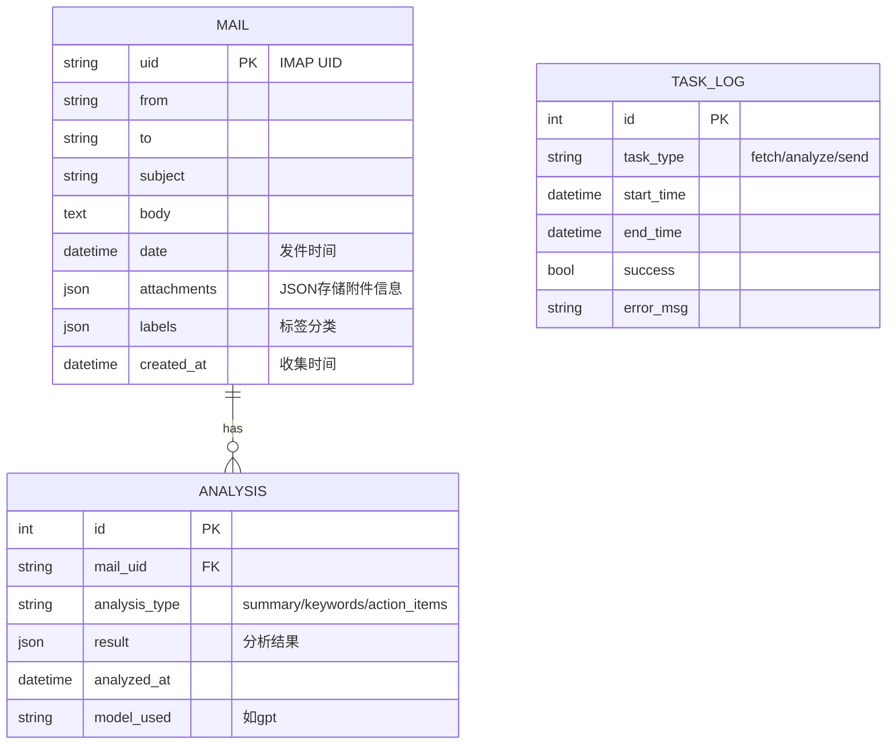
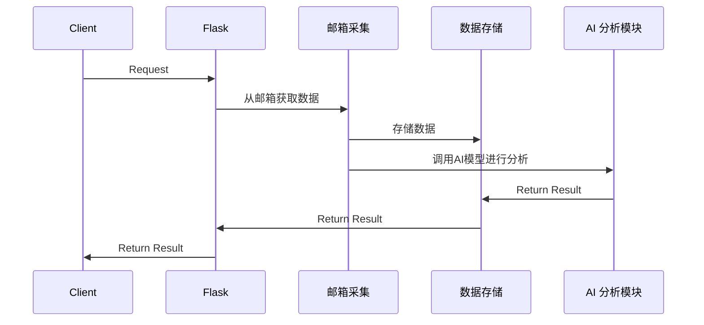

# 后端设计

首先，这个项目是一个前后端分离的项目，前端使用React NextJS。后端使用 Python Flask，前端和后端之间通过 `RESTful API` 进行通信。

## 核心模块

### 邮箱采集模块

### 邮箱登录模块

### 数据存储模块

#### 数据库设计

```mermaid
erDiagram
    MAIL ||--o{ ANALYSIS: has

    MAIL {
        string uid PK "IMAP UID"
        string from
        string to
        string subject
        text body
        datetime date "发件时间"
        json attachments "JSON存储附件信息"
        json labels "标签分类"
        datetime created_at "收集时间"
    }

    ANALYSIS {
        int id PK
        string mail_uid FK
        string analysis_type "summary/keywords/action_items"
        json result "分析结果"
        datetime analyzed_at
        string model_used "如gpt"
    }

    TASK_LOG {
        int id PK
        string task_type "fetch/analyze/send"
        datetime start_time
        datetime end_time
        bool success
        string error_msg
    }
```

### AI 分析模块

### 邮件发送模块

## 后端流程

```mermaid
sequenceDiagram
    participant Client
    participant Flask
    participant 邮箱采集
    participant 数据存储
    participant AI 分析模块
    Client ->> Flask: Request
    Flask ->> 邮箱采集: 从邮箱获取数据
    邮箱采集 ->> 数据存储: 存储数据
    邮箱采集 ->> AI 分析模块: 调用AI模型进行分析
    AI 分析模块 ->> 数据存储: Return Result
    数据存储 ->> Flask: Return Result
    Flask ->> Client: Return Result
```

