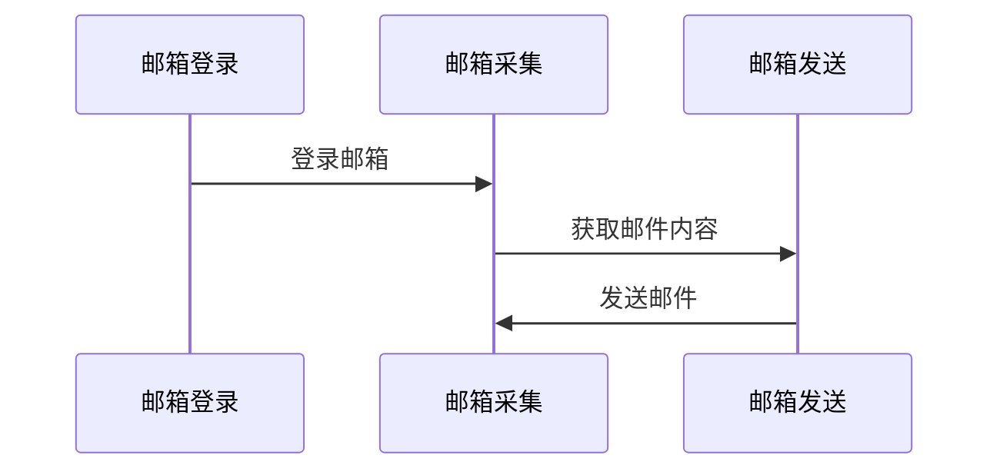
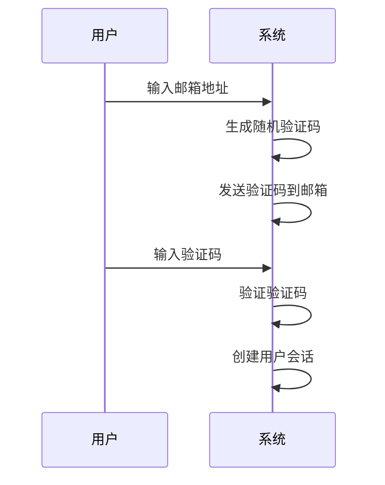
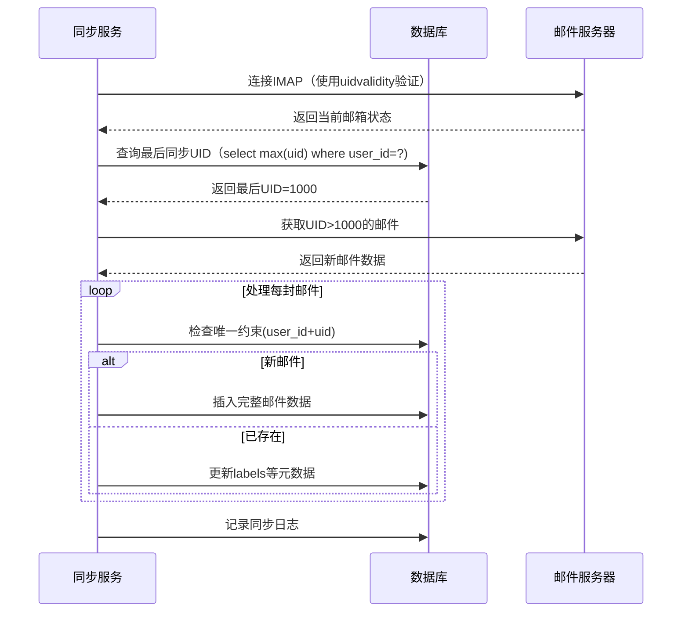
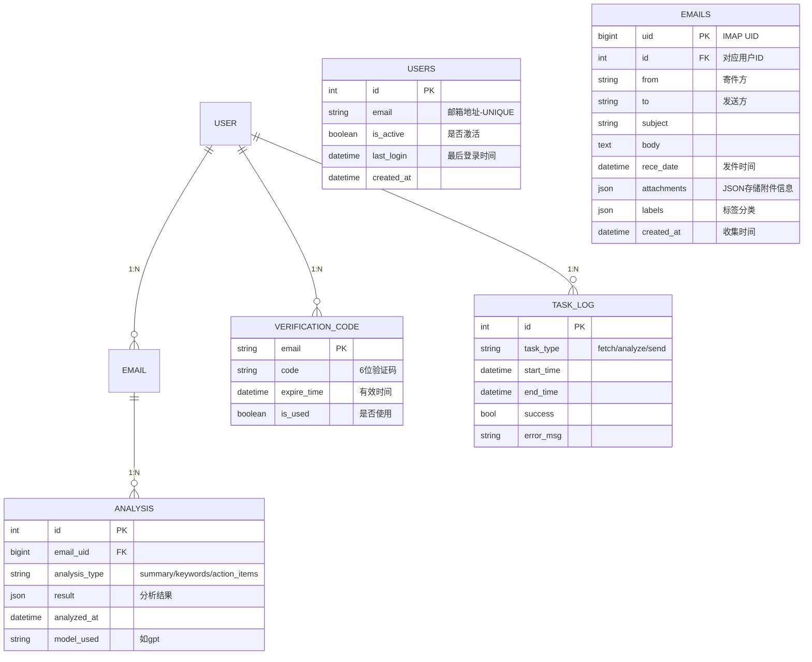
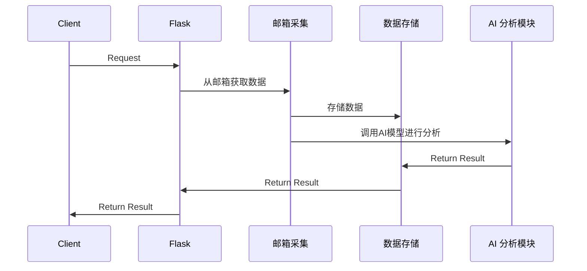

# 后端设计

首先，这个项目是一个前后端分离的项目，前端使用React NextJS。后端使用 Python Flask，前端和后端之间通过 `RESTful API` 进行通信。

## 核心模块

后端可以将登录的邮箱读取邮件存到数据库里面，这是一个后端的定时任务，而当前端使用AI对话式来分析邮箱的时候，比如：“分析我一个月的邮件信息，将相同类型的归纳”，而后端使用AI
API 向数据库读取邮件内容并分析最后将内容发送到邮箱和在对话式页面显示

### 邮箱模块

使用 python 自带的 `email` 库来处理邮件内容。
流程：



#### 邮箱登录模块

登录我打算使用验证码登录，因为密码登录的话，需要存储密码，这样不安全。

流程



1. 用户输入邮箱地址
2. 系统生成一个随机验证码（通常是4-6位数字）
3. 系统通过SMTP将验证码发送到用户邮箱
4. 用户从邮箱获取验证码并输入
5. 系统验证用户输入的验证码是否正确且未过期
6. 验证成功后，系统创建用户会话或JWT令牌

#### 邮箱采集模块

使用 `IMAP` 协议登录邮箱，获取邮件内容。

#### 邮箱发送模块

使用 `SMTP` 协议发送邮件。

学习一下邮箱的操作，额，我是不是不知量力了，好复杂



### 数据存储模块

使用 SQLite 数据库存储邮件内容。利用 ORM 框架 `SQLAlchemy` 来统一 ORM 模型定义范式.

#### 数据库设计



数据库模式应包括三个模型：“**MAIL**”，“**ANALYSIS**”和“**TASK_LOG**”。

大纲流程：

```text
邮箱服务器 → 定时任务 → EMAIL表 → AI分析 → ANALYSIS表
```

数据流程：

```text
用户登录 → 生成验证码 → 验证通过
触发邮箱同步 → 记录TASK_LOG → 存储EMAIL数据
发起分析请求 → 创建ANALYSIS记录 → 更新TASK_LOG状态
```

1. **MAIL**模型应捕获电子邮件元数据，包括发件人、收件人、主题、正文、附件（序列化格式，例如 JSON 或逗号分隔的文件名列表）、标签（序列化格式）和创建时间戳。
2. **ANALYSIS**模型应存储分析结果，通过外键链接回“MAIL”模型，并包括分析类型（例如情绪分析、主题提取）、分析结果本身（序列化格式）、分析的时间戳和使用的
   AI 模型（例如“GPT”、“DeepSeek”）。
3. **TASK_LOG**模型应跟踪任务的执行情况，例如获取、分析和发送电子邮件、记录开始和结束时间、成功状态（布尔值）以及任何错误消息（字符串）。
4. **VERIFICATION_CODE**模型应存储生成的验证码，包括电子邮件地址、验证、过期时间戳和是否使用的标志。
5. **USER**模型应存储用户信息，包括电子邮件地址、是否激活、最后登录时间和创建时间戳。

### AI 分析模块

### 邮件发送模块

## 后端流程


